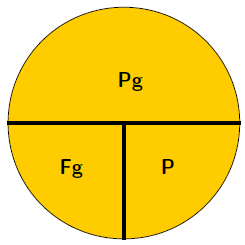
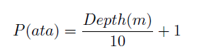
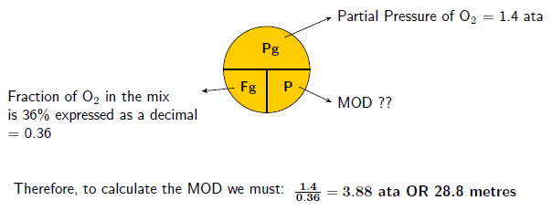
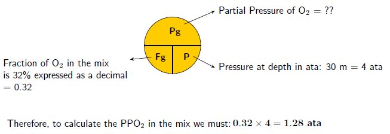
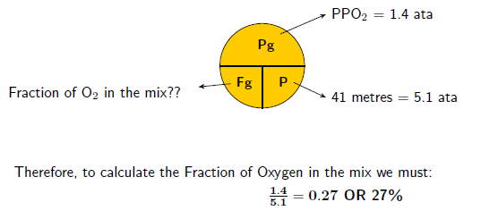
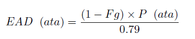
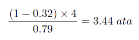

## Assignment 1: Computer Programming 1

**<mark>Read this document carefully! Any clarification should be sought at the earliest opportunity.  
Information about the assignment and assistance, where necessary, will be presented during lectures and tutorials.**
</mark>
### Scuba Diving Calculation Assistant

#### General Guidelines and Rationale

You have been approached by a local dive shop owner, who is tired of having to use a calculator to perform repetitive
calculations, to create an application to facilitate this process. The application you are to create should automate
some simple and more complex calculations that are common in the dive industry.

#### Underlying Concepts and Formulas

In scuba diving most of the time we breathe "_normal_" air which comprises 21% Oxygen and 79% Nitrogen. This can be
safely used to a depth of 68 metres, after which it becomes toxic and represents a considerable risk of causing Central
Nervous System (CNS) toxicity. To avoid this possibility certain "_rules_" are adhered to, one of which is limiting the
Partial Pressure of Oxygen (ppO2) in the mixture to a safe level. This level is usually in the range 1.1 ata to 1.6
_ata_ inclusive(_ata stands for - atmosphere absolute_). So how do we calculate the (ppO2)?  
The answer lies within a simple structure called the **Circled T** or **T in the Circle**, see Figure 1.

<figure>

<figcaption><b>Pg</b> = Partial Pressure of the gas expressed in <i>ata</i> 
<b>Fg</b> = Fraction of the gas in the mix expressed as a decimal 
<b>P</b> = Absolute pressure at depth expressed in <i>ata</i>  
Figure 1: The Circled T or T in the 
Circle</figcaption>
</figure>

In order to get our **P** in _ata_, we need to use another simple formula to convert depth in metres to _ata_. This is
given by:

So the questions become: How do we use the "T in the Circle"? and _what_ is it really for?  
The _'what is it for'_ can be answered by:

Sometimes we want to know the **Best Mix** of gas for a particular 'known' depth, or we may wish to know the maximum (
safe) depth we can dive for a particular (known/desired) fraction of gas, or sometimes we may just wish to know the
partial pressure of the gas we are breathing when at depth.

The _'how do we use it'_ can be explained as follows:

Simply, the bottom two notations multiplied together (**_Fg x P_**) equals the upper notation **_P
g_**
. i.e. **_Fg x P = Pg_**   
Also, if the upper notation **_Pg_** is divided by either of the bottom notations (**_Fg_** or
**_P_**), it will be equal to the remaining notation. i.e. **_Pg &div; Fg = P_**, or
**_Pg&div; P = Fg_**

####Example 1: Maximum Operating Depth (MOD)

####Example 2: Partial Pressure of oxygen (PPO2)

####Example 3: Fraction of Oxygen (Best Mix)

It is also useful to know the Equivalent Air Depth (EAD) to minimise Nitrogen Narcosis, or
as Jacques Cousteau called it "Rapture of the deep". The EAD is calculated on mixtures of
gas that contain more than the normal 21% of oxygen - and for the purpose of this assignment
upto 50%. i.e. 22 &#x2192; 50 inclusive. The simple formula is:

once we have the EAD in ata we can convert it to metres by using the depth formula.

####Example 4: Equivalent Air Depth (EAD)
The EAD for a 32% mixture of oxygen at a depth of 30 m would be: first convert our depth to
_ata_ using the **depth formula** to get _4 ata_, then substitute into the EAD formula:

  
then convert this back to a depth in metres using the **depth formula** to get _**24 m**_.

###Initial Specifications
The prototype will require a demonstration of the core algorithms that will prototype the general
operation of the application. It should be a text based application that will accept user input
and display the _Maximum Operating Depth (MOD)_ or, the _Best Mix (BM)_ for a certain
dive or, the _Partial Pressure (PP) of O2_ or, the _Equivalent Air Depth (EAD)_ for the requested
inputs.   
In addition, the application will be able to produce tables for _Equivalent Air Depths_
and _Partial Pressures_.

###Simple Calculations
In the first instance the client wishes to have simple calculations performed to assess the viability of the product and
as such only requires that the _MOD_, _BM_, _PP_, _EAD_ be calculated. In addition, the client also requests that an
additional calculation be added, _SMOD_, since the most common partial pressure for the MOD calculation is 1.4 ata.

Your program should ensure that all inputs are within the acceptable range and are suitable for the calculation
selected. Furthermore, the user should not be concerned about upper or lower case entries where text input is required.
Errors should be handled '_gracefully_' and messages should inform the user of the mistake and supply adequate
opportunity to either correct the error or perform another calculation.  
Calculations that involve Maximum Operating Depths and Best Mix, should be rounded down to keep within safe limits.

The following is a typical interaction session (user input is **<mark>highlighted in bold</mark>**):

<pre>
Welcome to the Dive Formula Calculator

Select which calculation you wish to perform
1. HELP
2. MOD
3. SMOD
4. BM
5. PP
6. EAD
7. Exit
Enter 1 to 7: <mark><b>0</b></mark>
Invalid Option. Please reenter: <mark><b>12</b></mark>
Invalid Option. Please reenter: <mark><b>A</b></mark>
Invalid Option. Please reenter: <mark><b>z</b></mark>
Invalid Option. Please reenter: <mark><b>2</b></mark>
Calculating the MOD
Enter the percentage of Oxygen: <mark><b>32</b></mark>
Enter the partial pressure of Oxygen (between 1.1 and 1.6 inclusive): <mark><b>1.4</b></mark>
Maximum operating depth (MOD) for a dive with 32% O2 and a partial pressure of 1.4 is 33 metres

Would you like to perform another calculation (y/n)? <mark><b>Y</b></mark>

Select which calculation you wish to perform
1. HELP
2. MOD
3. SMOD
4. BM
5. PP
6. EAD
7. Exit
Enter 1 to 7: <mark><b>3</b></mark>
Calculating the MOD for the standard 1.4 partial pressure
Enter the percentage of Oxygen: <mark><b>32</b></mark>
Maximum operating depth (MOD) for a dive with 32% O2 and a partial pressure of 1.4 is 33 metres

Would you like to perform another calculation (y/n)? <mark><b>y</b></mark>

Select which calculation you wish to perform
1. HELP
2. MOD
3. SMOD
4. BM
5. PP
6. EAD
7. Exit
Enter 1 to 7: <mark><b>4</b></mark>
Calculating the Best Mix
Enter the partial pressure of Oxygen (between 1.1 and 1.6 inclusive): <mark><b>1.5</b></mark>
Enter the depth of the dive (in metres): <mark><b>56</b></mark>
Best mix for a dive to 56.0 metres with a partial pressure of 1.5 is 22% O2

Would you like to perform another calculation (y/n)? <mark><b>y</b></mark>

Select which calculation you wish to perform
1. HELP
2. MOD
3. SMOD
4. BM
5. PP
6. EAD
7. Exit
Enter 1 to 7: <mark><b>5</b></mark>
Calculating the Partial Pressure
Enter the depth of the dive (in metres): <mark><b>40</b></mark>
Enter the percentage of Oxygen: <mark><b>23</b></mark>
The partial pressure of Oxygen for a dive to 40.0 metres with a percentage of Oxygen of 23% is 1.15 ata

Would you like to perform another calculation (y/n)? <mark><b>Y</b></mark>

Select which calculation you wish to perform
1. HELP
2. MOD
3. SMOD
4. BM
5. PP
6. EAD
7. Exit
Enter 1 to 7: <mark><b>6</b></mark>
Calculating the Equivalent Air Depth
Enter the depth of the dive (in metres): <mark><b>58</b></mark>
Enter the percentage of Oxygen: <mark><b>22</b></mark>
Equivalent Air Depth for a dive with 22% O2 to a depth of 58.0 metres is 57 metres

Would you like to perform another calculation (y/n)? <mark><b>n</b></mark>
</pre>

The Help menu item should give instructions for the acceptable use of the program and the
meaning of the menu items. For example, choosing HELP could result in the following output:

<pre>
You can select from the following choices: 
1. HELP	prints this message.
2. MOD	(Maximum Operating Depth) for a supplied percentage of Oxygen and partial pressure.
3. SMOD	(Standard Maximum Operating Depth) for a supplied percentage of Oxygen and a standard 1.4 partial pressure.
4. BM	(Best Mix) for a dive with a supplied partial pressure and depth (in metres).
5. PP	(Partial Pressure) for a supplied percentage of Oxygen and depth (in metres).
6. EAD	(Equivalent Air Depth) for a supplied percentage of Oxygen and depth (in metres).
7. EXIT	Exit the Dive Formula Calculator.

Would you like to perform another calculation (y/n)? 
</pre>

**Note**: Feel free to design an alternative method for selecting menu items if you wish.

---

#### _Ensure that you have tested your code comprehensively using JUnit tests_

---

### Complex Calculations

Once the simple calculations have been shown to work, the client requires that two tables be produced.  
The first is an _Equivalent Air Depth Table_ that will show the _EAD_'s for a _start_ and
_end_ **_percentage of Oxygen_** and a _start_ and _end_ **_depth_**.

The client only requires

- percentages of Oxygen from 18% to 50%, or any combinations within that range, in increments of 1%, and
- depths from 3 metres to 70 metres, or any combinations within that range, in increments of 3 metres.

The second is a _Table of Partial Pressures_ using the _same requirement_ for input as the
_EAD Table_, but any partial pressure _above 1.6_ should not be displayed. In addition, the _end_
values for both the _Oxygen content_ and the _depths_ are to be _larger than the start values_.

These calculations should be added as menu items and produce the required output.

The following is a typical interaction session using the two new menu items (user input is <mark><b>highlighted in
bold</b></mark>):

<pre>
Select which calculation you wish to perform
1. HELP
2. MOD
3. SMOD
4. BM
5. PP
6. EAD
7. PPT
8. EADT
9. Exit
Enter 1 to 9: <mark><b>7</b></mark>

Generating Partial Pressures Table
Enter a start and end percentage of Oxygen: <mark><b>33 40</b></mark>
Enter a start and end depth (in metres): <mark><b>15 40</b></mark>
Partial Pressures Table for 33 to 40 percent Oxygen and depths of 15 to 40 metres
=================================================================================

\	33	34	35	36	37	38	39	40		
________________________________________________________________________
15	0.83	0.85	0.88	0.90	0.93	0.95	0.98	1.00	
18	0.92	0.95	0.98	1.01	1.04	1.06	1.09	1.12	
21	1.02	1.05	1.08	1.12	1.15	1.18	1.21	1.24	
24	1.12	1.16	1.19	1.22	1.26	1.29	1.33	1.36	
27	1.22	1.26	1.29	1.33	1.37	1.41	1.44	1.48	
30	1.32	1.36	1.40	1.44	1.48	1.52	1.56	1.60	
33	1.42	1.46	1.50	1.55	1.59	
36	1.52	1.56	
39	

Would you like to perform another calculation (y/n)? <mark><b>y</b></mark>

Select which calculation you wish to perform
1. HELP
2. MOD
3. SMOD
4. BM
5. PP
6. EAD
7. PPT
8. EADT
9. Exit
Enter 1 to 9: <mark><b>8</b></mark>

Generating Equivalent Air Depths Table
Enter a start and end percentage of Oxygen: <mark><b>21 25</b></mark>
Enter a start and end depth (in metres): <mark><b>3 31</b></mark>
Equivalent Air Depth Table for 21 to 25 percent Oxygen and depths of 3 to 31 metres
====================================================================================

\   21  22  23  24  25	
________________________
3   3   3   3   3   2	
6   6   6   6   5   5	
9   9   9   9   8   8	
12  12  12  11	11  11	
15  15  15  14  14  14	
18  18  18  17  17  17	
21  21  21  20  20  19	
24  24  24  23  23  22	
27  27  27  26  26  25	
30  30  29  29  28  28	

Would you like to perform another calculation (y/n)? <mark><b>n</b></mark>

</pre>

---

#### _Ensure that you have tested your code comprehensively using JUnit tests_

---